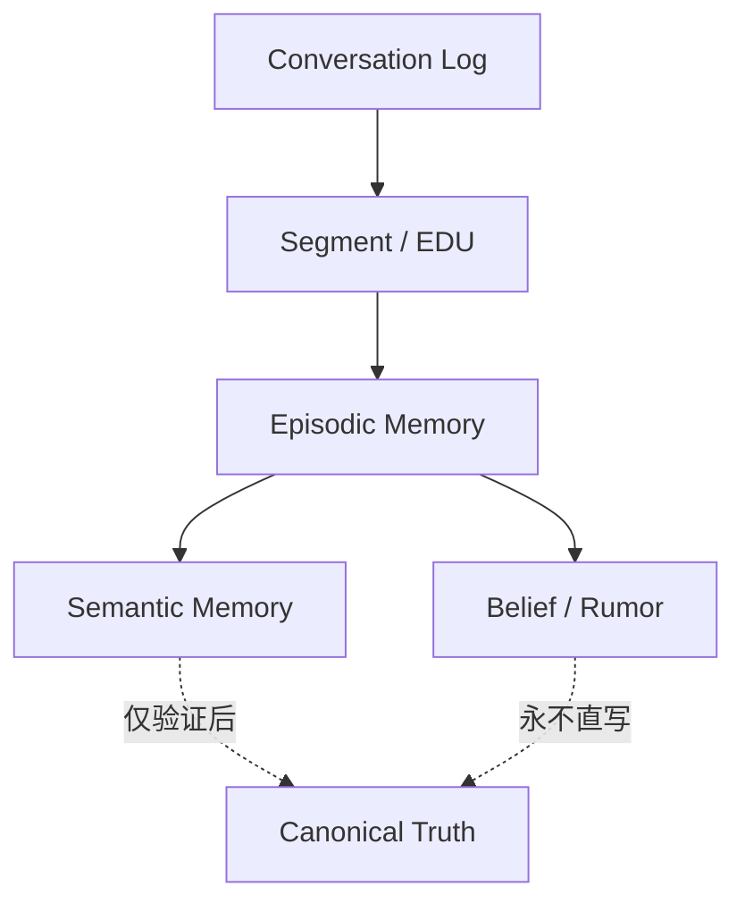
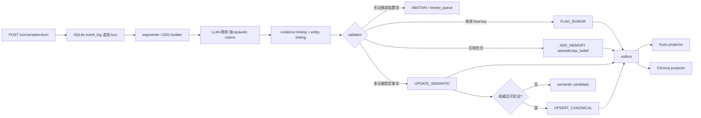
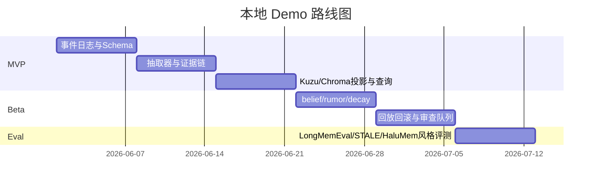

# 在事件溯源游戏世界图谱中把 NPC 对话转化为长期记忆图

## 执行摘要

延续你前一版报告“事件日志是真值源、图谱与向量库是物化视图、本地优先 SQLite + Kuzu + Chroma”的主线，最新研究给出的更强结论是：**conversation log 不应被直接压缩成“事实库”**，而应先保留为不可变全文证据，再逐层投影为**segment/EDU、episodic memory、semantic memory、belief/rumor、canonical truth**。尤其在长对话里，**segment-level** 与 **event-centric EDU** 往往优于 turn-level、session-level 和单纯摘要；而图结构真正有价值的地方，不是“把每句话都画成三元组”，而是承载**时间、冲突、来源、传播链、纠错链**。citeturn19view1turn19view2turn8view10turn8view11turn19view5turn26view0

因此，推荐的工程方案是：**SQLite 保存不可变对话事件流与 memory operations；Kuzu 保存 typed memory graph；Chroma 保存 turn/segment/episode 的向量索引；LLM 只产出带证据的候选 memory op，永不直接写 canonical truth**。canonical 只能由引擎事件、脚本事件或高权威、多证据校验后的事实更新；NPC 对话默认只写入 episodic、belief 或 rumor scope。这样既满足事件溯源、可回放和可解释，也能避免“幻觉被永久固化”。citeturn8view3turn8view4turn7view9turn7view10turn7view11turn9view1turn21view1turn22view0turn22view4

在治理层，最新基准已经把问题从“会不会记住”推进到“会不会**错记、过时、被污染、拒答**”。LongMemEval 把知识更新与 abstention 作为核心能力，STALE 专门测隐式冲突，HaluMem 把错误分解到 extraction / update / QA 三个操作层；而 false-memory 与 Mandela-effect 研究则说明：若不隔离 belief 与 canonical，社交传播和暗示式问法都可能把错误稳定写入长期记忆。citeturn7view7turn7view9turn7view10turn8view12turn8view13turn16view0

## 文献综述

下面的文献表只保留与“对话日志 → 长期 memory graph”最相关、且对工程落地最有借鉴价值的工作。

| 论文/项目 | 年份 | 核心贡献 | 对本方案的直接启发 | 优先来源 |
|---|---:|---|---|---|
| From Human Memory to AI Memory | 2025 | 把 AI memory 对齐到人类的 episodic / semantic / procedural 框架 | 记忆必须分型，episodic 与 semantic 不应混写 | citeturn7view0turn10view0turn10view2 |
| Episodic Memory is the Missing Piece | 2025 | 提出 episodic memory 的五个关键属性：长期、显式、单次学习、实例特异、上下文化 | 对话事件要保留 when/why/who/context，而不是只留 fact | citeturn24view0 |
| Graph-based Agent Memory | 2026 | 从 extraction、storage、retrieval、evolution 四阶段系统化图记忆 | memory graph 应按生命周期设计，而非只看 schema | citeturn8view14turn10view4 |
| SeCom | 2025 | 证明 turn/session/summarization 都有缺陷，segment-level memory 更优，并引入压缩去噪 | 原始对话先切“话题段”，再抽记忆，优于逐轮三元组化 | citeturn19view1turn19view2 |
| RMM | 2025 | Prospective/Retrospective reflection；检索由 cited evidence 反向修正 | 记忆更新应使用“带证据的反思”，不是一次性静态摘要 | citeturn8view7turn8view8turn19view0 |
| Mem0 | 2025 | 强调动态抽取、整合与 salient retrieval，并加入 graph memory 变体 | “记忆管理”应独立成模块，支持 consolidate / update | citeturn19view3turn19view4 |
| SGMem | 2025 | 句子图同时检索 raw dialogue 与 generated memory | 全文证据与派生记忆需要双轨共存 | citeturn8view10turn8view11 |
| Event-centric conversational memory | 2025 | 用 event-like EDUs 和异构图代替“纯三元组”或“纯摘要” | episodic layer 最好以事件命题为单位，而不是裸三元组 | citeturn19view5turn7view15 |
| TSM | 2026 | 建 semantic timeline，把点状记忆合并成 durative memory | 记忆应按“发生时间”而非“说话时间”组织 | citeturn8view3turn8view4 |
| Zep | 2025 | temporal knowledge graph for agent memory | 时间感知图很适合做 episodic/semantic 索引层 | citeturn8view0turn7view3 |
| LongMemEval / LoCoMo / STALE / HaluMem | 2024-2026 | 覆盖长对话 recall、knowledge update、abstention、implicit conflict、hallucination ops | 评测必须覆盖“更新、拒答、冲突处理”，不能只看 recall | citeturn7view7turn7view8turn7view9turn7view10 |
| AEVS | 2026 | anchor-constrained KG extraction with character-level provenance | 证据链应细到 span/char level，便于检测幻觉 | citeturn7view11 |
| Personalized NPCs | 2025 | 游戏 NPC 用短期 memory KG + AMR-KG 降低 character hallucination | 游戏场景需要“角色一致性层”，不能只依赖通用聊天记忆 | citeturn0search2 |
| False Memories / Mandela Effect | 2024-2026 | 证明 LLM 交互会诱发 false memory，社交传播会固化群体误记 | belief / rumor 必须与 canonical 隔离，并保留 source scrutiny | citeturn8view12turn8view13turn16view0 |

最新实证的关键修正是：**图有用，但不是万能**。2026 的统一框架论文显示，plain-index 与 graph-index 都可在统一流水线下比较；很多提升来自**更合理的 memory unit 设计、key/value 组织和更新策略**，不是单纯“上图”本身。因此本方案主张：**先把原始日志、segment、episode 做好，再让图负责关系、版本、冲突和传播**。citeturn26view0turn19view1turn19view5

## 分层记忆框架

推荐采用六层模型，并明确“哪一层可以写真相、哪一层只能写主观记忆”。

| 层 | 存储单位 | 典型内容 | 写入来源 | 一致性边界 |
|---|---|---|---|---|
| conversation log | turn / utterance | 全文、说话者、时序、引用 span | 所有对话 | **不可变**，永远不覆盖 |
| segment / EDU | topical segment / event proposition | 话题段、事件式命题、参与者、时间线索 | 分段器 + 抽取器 | 只能派生，不回写原文 |
| episodic memory | episode node | “谁在何时何地说/做了什么” | 对话、观察、系统反馈 | 可修正，但保留旧版 |
| semantic memory | fact node | 稳定偏好、关系、常态事实 | 多 episode 合并 | 不能直接覆盖 canonical |
| belief / rumor / misremembering | scoped claim | NPC 认为/听说/误记的内容 | hearsay、单源陈述、传播 | 与 canonical **物理/逻辑隔离** |
| canonical truth | authoritative fact | 当前真实世界状态 | 引擎/脚本/高权威验证 | 仅权威事件可写 |

语义上，episodic memory 存的是**实例**，semantic memory 存的是**归纳后的稳定知识**；belief/rumor 则是**带主体与来源的主观状态**。这与近两年对 episodic / semantic 区分、以及 belief graph 的研究方向一致。citeturn10view0turn24view0turn20search0turn20search3

建议所有层都做**双时间版本化**：`valid_from_turn / valid_to_turn` 表示游戏内有效时间，`recorded_at` 表示系统记录时间；关系上显式使用 `SUPPORTS`、`CONTRADICTS`、`SUPERSEDES`、`HEARD_FROM`、`CORRECTED_BY`、`DERIVED_FROM`。这样一来，“NPC 曾经相信过 X、后来被纠正为 Y”不会被覆盖掉，而会形成一条可回放的记忆演化链。STALE 说明真正困难的不是显式否定，而是**隐式冲突**；因此 `SUPERSEDES` 不应只靠字符串否定触发，而要做上下文推断。citeturn7view9turn9view1

显著性、衰减与去重建议按下面的形式实现，其中参数是工程可调超参：

```text
salience_i = sigmoid(
  a1*valence + a2*involvement + a3*repetition +
  a4*impact + a5*authority + a6*novelty - a7*age
)

strength_i(t) = salience_i * exp(-lambda_scope * Δt)
                * (1 + beta * recall_count_i)
                * (1 - delta * duplicate_penalty_i)
```

这里的灵感来自 Generative Agents 的 recency / relevance / importance 和记忆流设计，以及 MemoryBank 的遗忘曲线；但在游戏里应进一步区分 scope：`canonical≈不衰减`，`semantic=慢衰减`，`npc_belief=中等衰减`，`rumor=快衰减`。对同一 claim，若 `(主体集合、谓词、客体、时间桶)` 高重合且 embedding 相似度超过阈值，则执行 `MERGE_MEMORY`，保留 `merged_from[]` 和证据并集；若同 key 出现新值且带更新证据，则执行 `SUPERSEDES`，不删除旧记忆。citeturn8view9turn25search15turn9view1

belief / rumor / misremembering 的核心不是“造假”，而是**可追踪的偏差**。建议 scope 至少有：`canonical`、`semantic_shared`、`npc_belief:<npc_id>`、`rumor:<community>`、`uncertain`。误记可由三类机制产生：一是**摘要漂移**，二是**检索干扰与 primacy bias**，三是**社交传播**。2026 的干扰研究表明，LLM 在冲突信息下往往“记住更早、忘掉更新”，这正好解释了为什么不能把“最新一轮对话”简单塞进 prompt 里就当做完成更新。citeturn9view1turn27view0turn16view0



## 抽取更新与事件溯源

方法上，规则式解析适合战斗日志、交易日志、系统事件；LLM 三元组抽取适合高歧义自然对话；**推荐方案仍是混合式**：规则负责边界、实体标准化和 schema；LLM 负责事件化重写、主观性识别和隐含关系；最终由验证器决定写入哪一层。这个结论既来自图记忆生命周期研究，也和 HaluMem 对 extraction / update / QA 分层评估的结果一致。citeturn8view14turn7view10turn26view0

| 方法 | 适用输入 | 优点 | 主要风险 | 结论 |
|---|---|---|---|---|
| 规则式 | 系统日志、技能播报、模板化台词 | 高精度、低延迟 | 覆盖窄 | 作为保底通道 |
| LLM 抽取 | 自由对话、长剧情、含暗示/传闻文本 | 语义覆盖强 | 幻觉、漂移、实体混淆 | 只能产出候选 |
| 混合式 | 实际生产 | 可兼顾精度与覆盖 | 管线复杂 | **推荐** |

标准流程如下：



抽取 prompt 必须强制 evidence-first、scope-first。建议模板：

```text
你是“游戏记忆抽取器”，任务不是生成世界真相，而是把对话转为候选 memory ops。
要求：
1. 先识别说话行为是 observation / self-report / hearsay / speculation / correction。
2. 每条输出必须附 evidence spans；没有 spans 就 abstain。
3. 若与 canonical 或现有 semantic 冲突，不得覆盖；只能写 npc_belief、rumor 或 review。
4. 输出 JSON，不得解释。

输入：
- 对话片段
- 已知实体清单
- 当前 canonical 摘要
- 当前 npc scope
```

建议的标准化输出：

```json
{
  "source_event_id": "dlg_s1_t17",
  "scope": "rumor:village_square",
  "layer": "episodic",
  "ops": [
    {
      "op": "FLAG_RUMOR",
      "claim_id": "clm_001",
      "triple": ["silver_key", "located_in", "old_well"],
      "speaker": "npc_blacksmith",
      "certainty": "hearsay",
      "confidence": 0.46,
      "evidence": [
        {"turn_id": 17, "char_span": [12, 23], "quote": "我听说银钥匙掉进井里了"}
      ]
    }
  ]
}
```

置信度不要只用模型自报，建议做合成：`C = 0.3*schema + 0.25*evidence + 0.2*entity_link + 0.15*source_authority + 0.1*self_consistency`。若 `evidence_coverage=0`、`C<threshold`、或与 canonical 存在未解析冲突，则降级为 `abstain / rumor / review`。AEVS 说明 provenance 足够细时，幻觉才“可检测且可消除”；abstention 研究则说明“拒绝写入”本身就是正确能力。citeturn7view11turn18search0turn18search2

事件溯源层建议定义原子操作：`ADD_MEMORY`、`UPDATE_MEMORY`、`MERGE_MEMORY`、`DECAY_MEMORY`、`FLAG_RUMOR`、`CORRECT_MEMORY`、`RECALL_MEMORY`。事务上，**SQLite 单事务**写入 `conversation_turn`、`memory_candidate`、`memory_op`、`outbox`；Kuzu/Chroma 仅消费 outbox 并做幂等投影。回滚不直接“删图”，而是从 checkpoint 重放，或追加补偿事件。这样能天然支持 replay、审计、time-travel query。citeturn22view4turn21view1turn22view0

## 存储、治理与验证

本地 Demo 的推荐组合仍是 **SQLite + Kuzu + Chroma**：SQLite 适合做不可变事件账本和原子提交；Kuzu 是嵌入式 property graph，支持 in-process、Cypher 和 serializable ACID；Chroma 适合本地持久化向量索引。生产环境再演进为 **Postgres + Neo4j + Qdrant**：Postgres 提供更强的并发与序列化隔离，Neo4j 负责图服务，Qdrant 负责高维检索与 payload filter，但不承担跨节点强事务真值。citeturn22view4turn21view1turn21view3turn22view0turn22view1turn23view0turn15search0turn22view2turn13search0

| 存储 | 本地 Demo 角色 | 生产角色 | 关键结论 |
|---|---|---|---|
| SQLite | event_log / outbox / review_queue | 小型边缘节点 | 事务原子、最适合事件账本 citeturn22view4 |
| Kuzu | memory graph 主库 | 单机分析或嵌入式服务 | embedded + serializable ACID，适合本地 Demo citeturn21view1turn21view3 |
| Chroma | turn/segment/episode 向量检索 | 小规模服务 | PersistentClient 低运维、持久化简单 citeturn22view0turn22view1 |
| Postgres | — | event-sourcing 主账本 | Serializable 最严格，隔离模型清晰 citeturn23view0 |
| Neo4j | 可选 | 图服务/API | ACID 图数据库，适合多客户端查询 citeturn15search0turn15search2 |
| Qdrant | 可选 | 大规模向量检索 | filter 强，但点更新不提供强事务保证 citeturn22view2turn13search0 |

模型默认可采用 `Qwen3-8B/14B` 做抽取与校验，`bge-m3` 做 embedding；Qwen3 官方提供 8B/14B 等密集模型，bge-m3 支持 100+ 语言、dense / sparse / multi-vector 三种检索范式，适合中文 RPG 对话与知识混检。citeturn14search0turn14search1turn14search3

防止幻觉固化的最低工程要求有五条：**schema 约束、abstain 机制、evidence threshold、canonical 隔离、治理中间层**。最近的 SSGM 研究把 memory risks 总结为 input poisoning、semantic drift、retrieval hallucination、temporal obsolescence；因此建议加四个自动指标：`provenance_coverage`、`unsupported_claim_rate`、`stale_conflict_miss_rate`、`canonical_contamination_rate`。其中 drift 可用“当前 semantic 表述 vs 原始 ledger”的 embedding divergence 近似度量。citeturn9view1turn7view11turn7view9

建议的验证实验如下：

| 实验 | 输入 | 对照 | 指标 | 统计建议 |
|---|---|---|---|---|
| 幻觉固化率 | 含误导陈述与后续纠正的长对话 | summary-only / vector-only / layered graph | unsupported semantic write、canonical contamination、QA-F1 | 配对 McNemar + bootstrap CI |
| 记忆检索准确率 | LoCoMo/LongMemEval 风格 QA | turn-level / segment-level / event-centric | Recall@k、F1、延迟 | 配对 t-test 或 Wilcoxon citeturn7view7turn7view8turn19view1turn19view5 |
| 隐式冲突处理 | STALE 风格更新对话 | 无 supersedes / 有 supersedes | stale-premise resistance、state resolution | 分层 bootstrap citeturn7view9 |
| rumor 传播模拟 | 多 NPC 网络、单点谣言与权威澄清 | 无 scope 隔离 / 有 scope 隔离 | false-belief prevalence、time-to-correction | 网络层级回归 citeturn16view0 |
| 人评自然度 | RPG 多轮 NPC 对话 | 仅 canonical / belief-aware | coherence、persona consistency、“像不像记得你” | 双盲 Likert + Krippendorff α |

## 路线图与参考实现

本地 Demo 不依赖 Questrag，可按“三周 MVP + 两周 Beta + 一周评测/回放”推进。



建议 REST API：

| API | 作用 |
|---|---|
| `POST /v1/conversation/turn` | 追加不可变 turn 到 SQLite |
| `POST /v1/memory/extract` | 对指定 session/turn 产生候选 memory ops |
| `POST /v1/memory/apply` | 校验后写入 memory_op 与 outbox |
| `GET /v1/memory/query` | 按 `npc_id + scope + mode(roleplay/dev)` 取回记忆 |
| `POST /v1/admin/replay` | 从 event_log 重建 Kuzu/Chroma |
| `POST /v1/admin/reconcile` | 检查 drift、stale conflict、canonical contamination |

关键伪代码如下：

```python
def ingest_turn(db, turn):
    with db.tx() as tx:
        tx.insert("conversation_turn", turn)
        tx.insert("event_log", {
            "event_type": "ConversationTurnAdded",
            "payload": turn,
        })
        tx.insert("outbox", {
            "topic": "memory.extract",
            "key": turn["turn_id"]
        })

def apply_memory_ops(db, ops):
    with db.tx() as tx:
        for op in ops:
            if not op["evidence"]:
                tx.insert("review_queue", {"reason": "missing_evidence", "op": op})
                continue
            if conflicts_with_canonical(tx, op):
                op["op"] = "FLAG_RUMOR"
                op["scope"] = op.get("scope", "uncertain")
            tx.insert("memory_op", op)
            tx.insert("event_log", {"event_type": op["op"], "payload": op})
            tx.insert("outbox", {"topic": "memory.project", "key": op["claim_id"]})
```

```python
def merge_policy(existing, incoming):
    same_anchor = existing["triple_norm"] == incoming["triple_norm"]
    close_time = overlap(existing["valid_time"], incoming["valid_time"]) > 0.5
    similar = cosine(existing["embedding"], incoming["embedding"]) > 0.92
    if same_anchor and close_time and similar:
        return "MERGE_MEMORY"
    if existing["fact_key"] == incoming["fact_key"] and existing["value"] != incoming["value"]:
        return "SUPERSEDES"
    return "ADD_MEMORY"
```

## 结论与可直接开始的 PoC

结论可以压缩成一句话：**NPC 对话不应直接变成“真相三元组”，而应先进入不可变 conversation ledger，再以 event/segment 为中心派生 episodic memory，随后在 evidence、time、scope 与 authority 约束下，谨慎沉淀为 semantic memory；belief、rumor、misremembering 必须长期存在，但必须与 canonical truth 隔离。** 最新研究还提示我们：图结构很强，但不要把它当成记忆系统的全部，**raw log、segment、event proposition、scope、provenance** 才是长期稳定性的真正底座。citeturn26view0turn19view1turn19view5turn7view11turn9view1

下面给出 5 个可以立刻开做的小型 PoC：

| PoC | 目标 | 输入 | 预期输出 | 评估指标 | 所需资源 |
|---|---|---|---|---|---|
| 对话入账与证据链 | 验证全文不可变 + span 证据 | 200 轮 RPG 对话 | SQLite turn ledger + 带 span 的候选记忆 | provenance_coverage、写入延迟 | SQLite、FastAPI、Qwen3-8B |
| segment/EDU 记忆抽取 | 比较 turn vs segment vs EDU | 同一批长对话 | episode graph | Recall@k、QA-F1 | Kuzu、Chroma、bge-m3 |
| belief/rumor 隔离 | 验证谣言不污染 canonical | 带 hearsay 的村庄传闻脚本 | `npc_belief` / `rumor` scope 图 | canonical contamination=0 | SQLite+Kuzu |
| implicit conflict 纠错 | 验证 supersedes 与 stale handling | 先旧偏好、后隐式更新的对话 | semantic/belief 版本链 | stale-conflict miss rate | STALE 风格合成数据 |
| NPC 角色记忆对话 | 验证 belief-aware roleplay | 一名 NPC 的 30 轮历史互动 | 主观但可解释的应答 | coherence、persona consistency、引用正确率 | Qwen3-8B/14B、Chroma、Kuzu |