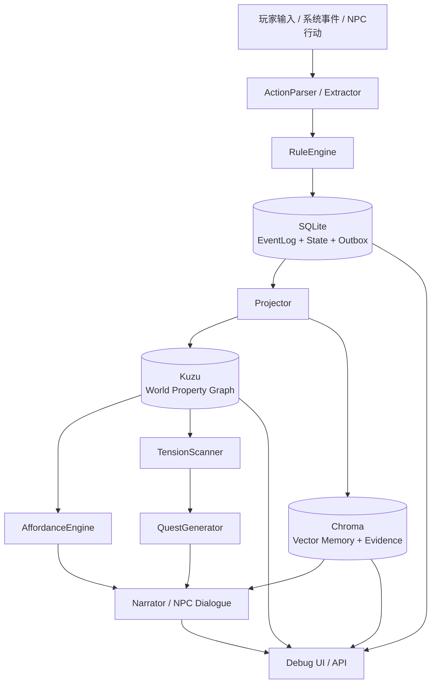

# SQLite + Kuzu + Chroma 完整本地 Demo 方案

## 1. 方案定位

本方案用于把当前 `game-world-kg` 从“城门 MVP 验证版”升级为严格遵循研究报告的**完整本地 Demo**。

研究报告已经明确推荐本地 Demo 采用：

```text
SQLite + Kuzu + Chroma
```

并以：

```text
事件溯源属性图 + 规则引擎 + 向量记忆
```

作为理论与工程主线。

因此本方案不再采用“先 SQLite，以后再说”的渐进计划，而是直接设计成完整本地三存储架构：

```text
SQLite  = 事务型事件日志 / source of truth / 状态投影 / 审计
Kuzu    = 本地嵌入式属性图 / 世界结构图 / 时态关系查询
Chroma  = 本地向量记忆 / 长文本证据 / 叙事与 NPC 记忆检索
```

一句话目标：

> 做出一个可本地运行、可试玩 30～50 回合的小型村庄 Demo，完整验证事件日志、属性图、规则引擎、Affordance、NPC 记忆、谣言、任务生成、证据检索和 replay/rollback。

---

## 2. 研究报告约束

完整本地 Demo 必须遵守以下原则。

### 2.1 Event Log 是 source of truth

所有世界变化必须先写入 SQLite 事件日志。

```text
玩家行动
系统事件
NPC 行动
任务变化
资源变化
记忆变化
```

都必须变成 EventRecord。

Kuzu 和 Chroma 都不是真值源，只是物化视图和检索层。

---

### 2.2 SQLite / Kuzu / Chroma 分工明确

```text
SQLite：真值、事务、状态快照、事件回放、outbox、审计
Kuzu：实体关系、时态图查询、世界结构、Affordance 查询支持
Chroma：叙事文本、证据片段、NPC 长期记忆、语义检索
```

禁止：

```text
Chroma 直接决定世界真相
Kuzu 直接覆盖 EventLog
LLM 直接修改 canonical state
```

---

### 2.3 混合式图谱构建

采用三路输入：

```text
权威系统事件      → 直接写 SQLite EventLog
低歧义结构事实    → 规则/解析器抽取
高歧义叙事文本    → LLM 严格 Schema 抽取候选
```

LLM 输出只进入候选区，必须经过：

```text
Schema 校验
RuleEngine 校验
ScopeRouter 分流
ConflictResolver 冲突处理
```

---

### 2.4 五层图谱必须落地

本地 Demo 必须实际覆盖：

```text
Static World Graph      静态世界图
Dynamic State Graph     动态状态图
Affordance Graph        可供性图
Event / Quest Graph     事件任务图
Narrative Memory Graph  叙事记忆图
```

其中 Kuzu 负责表达图结构，SQLite 负责事件与状态真值，Chroma 负责长文本证据。

---

### 2.5 Scope 分层必须严格

必须支持：

```text
canonical：世界真相
player：玩家已知
npc：某 NPC 主观记忆
faction：势力认知
rumor：传闻/误解
candidate：候选事实
rejected：被拒绝候选
```

尤其要验证：

```text
rumor 不污染 canonical
npc memory 不等于 world truth
candidate 不自动进入 canonical
```

---

## 3. 完整本地架构



核心链路：

```text
玩家行动
→ ActionParser 解析候选 action
→ RuleEngine 校验
→ SQLite 写 EventLog + StateDelta + Outbox
→ Projector 投影 SQLite State
→ Kuzu 更新世界图
→ Chroma 写证据/记忆向量
→ AffordanceEngine 从 SQLite+Kuzu 推导当前动作
→ TensionScanner 扫描世界矛盾
→ QuestGenerator 生成任务候选
→ Narrator 生成叙事
```

---

## 4. 本地存储设计

## 4.1 SQLite：source of truth

SQLite 负责强一致本地事务。

### 4.1.1 核心表

```sql
worlds
turns
events
state_deltas
states
source_texts
evidence_refs
extraction_candidates
memories
outbox
projection_status
```

### 4.1.2 events

```sql
CREATE TABLE IF NOT EXISTS events (
    id TEXT PRIMARY KEY,
    world_id TEXT NOT NULL,
    turn_id TEXT,
    turn_index INTEGER NOT NULL,
    event_order INTEGER NOT NULL,
    event_type TEXT NOT NULL,
    actor_id TEXT,
    participants_json TEXT NOT NULL DEFAULT '[]',
    payload_json TEXT NOT NULL,
    evidence_refs_json TEXT NOT NULL DEFAULT '[]',
    causal_parents_json TEXT NOT NULL DEFAULT '[]',
    created_at TEXT NOT NULL
);
```

### 4.1.3 state_deltas

```sql
CREATE TABLE IF NOT EXISTS state_deltas (
    id TEXT PRIMARY KEY,
    event_id TEXT NOT NULL,
    entity_id TEXT NOT NULL,
    attr TEXT NOT NULL,
    old_value_json TEXT,
    new_value_json TEXT,
    delta_json TEXT,
    scope TEXT NOT NULL DEFAULT 'canonical'
);
```

### 4.1.4 states

```sql
CREATE TABLE IF NOT EXISTS states (
    world_id TEXT NOT NULL,
    entity_id TEXT NOT NULL,
    attr TEXT NOT NULL,
    value_json TEXT NOT NULL,
    updated_turn INTEGER NOT NULL,
    scope TEXT NOT NULL DEFAULT 'canonical',
    source_event_id TEXT,
    PRIMARY KEY (world_id, entity_id, attr, scope)
);
```

### 4.1.5 source_texts

```sql
CREATE TABLE IF NOT EXISTS source_texts (
    id TEXT PRIMARY KEY,
    world_id TEXT NOT NULL,
    source_type TEXT NOT NULL,
    text TEXT NOT NULL,
    turn_id TEXT,
    created_at TEXT NOT NULL
);
```

### 4.1.6 evidence_refs

```sql
CREATE TABLE IF NOT EXISTS evidence_refs (
    id TEXT PRIMARY KEY,
    world_id TEXT NOT NULL,
    source_id TEXT NOT NULL,
    source_type TEXT NOT NULL,
    span_start INTEGER,
    span_end INTEGER,
    text TEXT,
    extractor TEXT,
    confidence REAL NOT NULL DEFAULT 1.0,
    created_at TEXT NOT NULL
);
```

### 4.1.7 extraction_candidates

```sql
CREATE TABLE IF NOT EXISTS extraction_candidates (
    id TEXT PRIMARY KEY,
    world_id TEXT NOT NULL,
    source_id TEXT NOT NULL,
    candidate_json TEXT NOT NULL,
    scope TEXT NOT NULL,
    confidence REAL NOT NULL DEFAULT 0.5,
    status TEXT NOT NULL DEFAULT 'candidate',
    reason TEXT,
    created_at TEXT NOT NULL
);
```

### 4.1.8 outbox

Kuzu / Chroma 更新通过 outbox 驱动，即使本地单进程也保留该模型。

```sql
CREATE TABLE IF NOT EXISTS outbox (
    id TEXT PRIMARY KEY,
    world_id TEXT NOT NULL,
    event_id TEXT NOT NULL,
    topic TEXT NOT NULL,
    payload_json TEXT NOT NULL,
    status TEXT NOT NULL DEFAULT 'pending',
    retry_count INTEGER NOT NULL DEFAULT 0,
    created_at TEXT NOT NULL,
    processed_at TEXT
);
```

推荐 topic：

```text
kuzu_graph_update
chroma_evidence_upsert
chroma_memory_upsert
projection_rebuild
```

### 4.1.9 projection_status

```sql
CREATE TABLE IF NOT EXISTS projection_status (
    world_id TEXT NOT NULL,
    projector TEXT NOT NULL,
    projected_turn INTEGER NOT NULL DEFAULT 0,
    updated_at TEXT NOT NULL,
    PRIMARY KEY (world_id, projector)
);
```

---

## 4.2 Kuzu：本地属性图

Kuzu 负责本地属性图查询，不承担真值。

### 4.2.1 为什么用 Kuzu

研究报告推荐 Kuzu 用于本地 Demo，因为它是嵌入式、属性图、本地集成成本低，适合编辑器/单机工具和 Demo。

Kuzu 的职责：

```text
实体关系查询
时态图查询
邻居查询
任务依赖查询
NPC 关系查询
Affordance 支持查询
Tension 扫描支持
```

### 4.2.2 Kuzu 文件位置

```text
.data/kuzu/
```

### 4.2.3 节点表设计

```cypher
CREATE NODE TABLE Entity(
    id STRING,
    world_id STRING,
    stable_key STRING,
    entity_type STRING,
    name STRING,
    scope STRING,
    version INT64,
    valid_from_turn INT64,
    valid_to_turn INT64,
    confidence DOUBLE,
    source_event_id STRING,
    properties_json STRING,
    PRIMARY KEY(id)
);
```

### 4.2.4 关系表设计

```cypher
CREATE REL TABLE RELATES(
    FROM Entity TO Entity,
    rel_type STRING,
    scope STRING,
    version INT64,
    valid_from_turn INT64,
    valid_to_turn INT64,
    confidence DOUBLE,
    source_event_id STRING,
    properties_json STRING
);
```

### 4.2.5 Event 节点

```cypher
CREATE NODE TABLE EventNode(
    id STRING,
    world_id STRING,
    event_type STRING,
    turn_index INT64,
    actor_id STRING,
    payload_json STRING,
    created_at STRING,
    PRIMARY KEY(id)
);
```

### 4.2.6 Event 关系

```cypher
CREATE REL TABLE EVENT_TARGETS(FROM EventNode TO Entity, role STRING);
CREATE REL TABLE EVENT_CAUSED_BY(FROM EventNode TO EventNode);
CREATE REL TABLE EVENT_CHANGED(FROM EventNode TO Entity, attr STRING, old_value_json STRING, new_value_json STRING);
```

### 4.2.7 Memory 节点

```cypher
CREATE NODE TABLE MemoryNode(
    id STRING,
    world_id STRING,
    owner_id STRING,
    truth_scope STRING,
    salience DOUBLE,
    valence DOUBLE,
    confidence DOUBLE,
    memory_text STRING,
    source_event_id STRING,
    PRIMARY KEY(id)
);
```

### 4.2.8 Memory 关系

```cypher
CREATE REL TABLE REMEMBERS(FROM Entity TO MemoryNode);
CREATE REL TABLE MEMORY_ABOUT(FROM MemoryNode TO Entity);
CREATE REL TABLE MEMORY_FROM_EVENT(FROM MemoryNode TO EventNode);
```

### 4.2.9 Kuzu 投影原则

```text
SQLite EventLog 提交成功后，写 outbox。
KuzuProjector 读取 outbox，幂等更新 Kuzu。
Kuzu 可清空并从 SQLite replay 重建。
```

幂等键：

```text
event_id + projector_name
```

---

## 4.3 Chroma：向量记忆与证据检索

Chroma 用于本地持久化向量记忆。

### 4.3.1 Chroma 目录

```text
.data/chroma/
```

### 4.3.2 Collection 设计

```text
world_sources       原始文本与证据片段
world_memories      NPC/势力/玩家记忆
world_events        事件摘要
world_rules         规则说明与 ActionTemplate 文档
world_quests        任务与 tension 摘要
```

### 4.3.3 Metadata 设计

每条 Chroma 文档必须带：

```json
{
  "world_id": "demo_village",
  "source_id": "turn_12_input",
  "source_type": "player_input",
  "turn_index": 12,
  "scope": "npc",
  "owner_id": "guard_alos",
  "source_event_id": "evt_00042",
  "confidence": 0.8
}
```

### 4.3.4 Embedding 策略

默认支持两种模式：

```text
mock embedding：测试与无模型环境
bge-m3 embedding：真实本地 Demo
```

配置：

```text
GAME_WORLD_KG_EMBEDDING_PROVIDER=mock|openai_compatible
GAME_WORLD_KG_EMBEDDING_BASE_URL=http://localhost:5001/v1
GAME_WORLD_KG_EMBEDDING_MODEL=bge-m3
```

### 4.3.5 Chroma 写入来源

```text
source_texts         → world_sources
events 摘要          → world_events
memories             → world_memories
rules/action docs    → world_rules
quest/tension docs   → world_quests
```

### 4.3.6 Chroma 读取场景

```text
NPC 对话前，按 owner_id + query 检索 world_memories
Narrator 生成前，检索相关事件证据
QuestGenerator 需要长文本背景时，检索 world_sources/world_events
ExtractionPipeline 消歧时，检索相似历史文本
```

### 4.3.7 安全约束

Chroma 结果只作为上下文，不直接改状态。

```text
Chroma recall → LLM context
Chroma recall ≠ canonical fact
```

---

## 5. 模块设计

建议目录结构：

```text
src/game_world_kg/
├── api.py
├── config.py
├── db.py
├── sqlite_store.py
├── kuzu_store.py
├── chroma_store.py
├── events.py
├── projector.py
├── graph_projector.py
├── vector_projector.py
├── action_template.py
├── predicate.py
├── effect.py
├── rules.py
├── affordance.py
├── extraction.py
├── memory.py
├── tension.py
├── quest.py
├── explanation.py
├── evaluation.py
├── seed_village.py
└── static/
```

---

## 6. 核心模块细化

## 6.1 SQLiteStore

职责：

```text
初始化 SQLite schema
写 EventLog
写 StateDelta
写 source_text/evidence/candidate
写 outbox
读取当前 states
replay_to_turn
```

关键方法：

```python
class SQLiteStore:
    def append_event(...): ...
    def append_state_delta(...): ...
    def upsert_state(...): ...
    def append_source_text(...): ...
    def append_evidence_ref(...): ...
    def append_extraction_candidate(...): ...
    def append_outbox(...): ...
    def list_pending_outbox(...): ...
```

---

## 6.2 KuzuStore

职责：

```text
初始化 Kuzu schema
upsert Entity
upsert Relation
upsert EventNode
upsert MemoryNode
查询 neighbors
查询 path
查询 scope graph
查询 current valid graph
```

关键方法：

```python
class KuzuStore:
    def init_schema(...): ...
    def upsert_entity(...): ...
    def upsert_relation(...): ...
    def upsert_event(...): ...
    def upsert_memory(...): ...
    def query_neighbors(...): ...
    def query_current_graph(...): ...
```

注意：Kuzu 更新必须幂等。

---

## 6.3 ChromaStore

职责：

```text
初始化 collections
写 source/evidence/event/memory/rule/quest 文档
按 world_id/scope/owner_id 过滤检索
支持 mock embedding 和真实 embedding
```

关键方法：

```python
class ChromaStore:
    def upsert_source(...): ...
    def upsert_memory(...): ...
    def upsert_event_summary(...): ...
    def search_memories(world_id, owner_id, query, limit): ...
    def search_evidence(world_id, query, scope=None, limit=5): ...
```

---

## 6.4 Projector

职责：

```text
从 SQLite EventLog 投影到 SQLite states
生成 Kuzu outbox
生成 Chroma outbox
支持 replay/rebuild
```

投影分三层：

```text
StateProjector       SQLite states
KuzuProjector        Kuzu graph
ChromaProjector      Chroma collections
```

---

## 6.5 ActionTemplateEngine

职责：

```text
读取 action_templates
根据 target_selector 绑定候选目标
运行 preconditions
生成 affordance
被 RuleEngine 用于 resolve action
```

第一批模板：

```text
move_to_location
inspect_entity
talk_to_npc
show_item_to_npc
request_access
bribe_npc
steal_item
ask_about_rumor
clarify_rumor
trade_item
```

---

## 6.6 PredicateEvaluator

第一批 Predicate：

```text
same_location(a, b)
connected_location(from, to)
has_item(actor, item)
state_equals(entity, attr, value)
state_not_equals(entity, attr, value)
relation_at_least(entity, attr, value)
resource_at_least(entity, attr, value)
memory_exists(owner, query, scope)
scope_allowed(scope)
```

---

## 6.7 EffectExecutor

第一批 Effect：

```text
move_entity
transfer_item
set_state
delta_resource
change_relation
add_memory
add_rumor
start_quest
complete_quest
append_source_text
```

EffectExecutor 不直接修改 Kuzu/Chroma，只生成 EventRecord + StateDelta，写 SQLite。

---

## 6.8 TensionScanner

扫描：

```text
locked_location
trust_below_threshold
rumor_unresolved
resource_shortage
item_missing
npc_goal_blocked
hostility_rising
quest_dependency_missing
```

输出 tension：

```json
{
  "tension_id": "tension_guard_trust_low",
  "type": "trust_below_threshold",
  "reason": "守卫信任不足，无法放行。",
  "evidence": [],
  "affected_entities": ["guard_alos", "player", "iron_gate"],
  "suggested_actions": ["show_item_to_npc", "bribe_npc"]
}
```

---

## 6.9 QuestGenerator

从 TensionScanner 生成任务。

任务必须带：

```text
quest_id
title
reason
tension_id
depends_on
required_state
reward
failure_consequence
evidence
```

禁止：

```text
无 evidence 的任务
目标实体不存在的任务
奖励不可兑现的任务
```

---

## 6.10 ExplanationService

接口：

```text
GET /worlds/{world_id}/explain/state/{entity_id}/{attr}
GET /worlds/{world_id}/explain/event/{event_id}
GET /worlds/{world_id}/explain/quest/{quest_id}
GET /worlds/{world_id}/explain/memory/{memory_id}
```

回答：

```text
当前状态是什么
由哪些事件造成
证据片段是什么
是否来自 canonical / npc / rumor
Kuzu 相关路径是什么
Chroma 相关证据是什么
```

---

## 7. 完整本地 Demo 内容设计

## 7.1 世界：小村庄 Demo

世界 ID：

```text
demo_village
```

### 地点

```text
village_gate      村口
iron_gate         铁门
guard_room        守卫室
village_square    村广场
tavern            酒馆
warehouse         仓库
well              井边
inner_city        内城入口
market_stall      市集摊位
```

### NPC

```text
player               玩家
guard_alos           守卫阿洛斯
tavern_keeper_mira   酒馆老板米拉
merchant_borin       商人伯林
village_chief        村长
suspicious_traveler  可疑旅人
warehouse_keeper     仓库管理员
```

### 物品

```text
pass_token        通行令
silver_key        银钥匙
warehouse_key     仓库钥匙
coin_pouch        钱袋
grain_bag         粮袋
rumor_note        传闻纸条
water_bucket      水桶
ledger_book       仓库账本
```

### 势力

```text
gate_watch        城门卫队
village_council   村议会
merchant_circle   商人圈
tavern_public     酒馆人群
```

---

## 7.2 三条核心 tension 线

### 线 1：通行线

初始：

```text
iron_gate.open = false
guard_alos.trust.player = 3
player has pass_token
```

目标：

```text
进入 inner_city
```

可解法：

```text
出示通行令
提高守卫信任
拿到银钥匙
贿赂守卫
绕开风险行动
```

---

### 线 2：谣言线

初始：

```text
rumor: 玩家和银钥匙失窃有关
canonical: silver_key.holder = guard_alos
```

目标：

```text
澄清谣言 / 利用谣言 / 追查源头
```

涉及：

```text
tavern_keeper_mira
suspicious_traveler
guard_alos
village_chief
```

要求：

```text
rumor 不污染 canonical
NPC 可基于 rumor 行动
玩家可通过证据改变 npc/faction 认知
```

---

### 线 3：仓库线

初始：

```text
warehouse.locked = true
warehouse_key.holder = warehouse_keeper
grain_bag 位于 warehouse
merchant_borin 想购买粮食
village_chief 不完全信任 merchant_borin
```

目标：

```text
调查仓库粮食问题
协商交易
偷查账本
帮助村长确认商人是否囤粮
```

验证：

```text
多 NPC 目标
资源 tension
任务链生成
NPC 记忆
faction 认知
```

---

## 8. API 设计

保留现有 API，新增：

```text
GET /worlds/{world_id}/kuzu/graph
GET /worlds/{world_id}/kuzu/neighbors/{entity_id}
GET /worlds/{world_id}/chroma/search/evidence?query=...
GET /worlds/{world_id}/chroma/search/memories?owner_id=...&query=...
GET /worlds/{world_id}/tensions
GET /worlds/{world_id}/explain/state/{entity_id}/{attr}
GET /worlds/{world_id}/explain/quest/{quest_id}
POST /worlds/{world_id}/projectors/run
POST /worlds/{world_id}/projectors/rebuild
```

---

## 9. Debug UI 要求

调试面板必须显示：

```text
当前地点
当前可行动作
SQLite states
SQLite events
Kuzu graph 查询结果
Chroma memory/evidence 查询结果
NPC memories
Rumors
Tensions
Quests
State explanation
Projection status
```

目标是：

> 玩家能玩，开发者能看清楚世界为什么变成这样。

---

## 10. 依赖升级

`pyproject.toml` 增加：

```toml
kuzu>=0.7
chromadb>=0.5
httpx>=0.27
```

可选：

```toml
numpy>=1.26
```

embedding 默认 mock，避免没有本地 embedding 服务时无法跑 Demo。

---

## 11. 配置项

`.env.example` 增加：

```text
GAME_WORLD_KG_DB=.data/game_world_kg.sqlite3
GAME_WORLD_KG_KUZU_PATH=.data/kuzu
GAME_WORLD_KG_CHROMA_PATH=.data/chroma

GAME_WORLD_KG_LLM_ENABLED=1
GAME_WORLD_KG_LLM_BASE_URL=http://localhost:5001/v1
GAME_WORLD_KG_LLM_MODEL=qwen3
GAME_WORLD_KG_LLM_API_KEY=

GAME_WORLD_KG_EMBEDDING_PROVIDER=mock
GAME_WORLD_KG_EMBEDDING_BASE_URL=http://localhost:5001/v1
GAME_WORLD_KG_EMBEDDING_MODEL=bge-m3
GAME_WORLD_KG_EMBEDDING_API_KEY=
```

---

## 12. 开发阶段

## Phase 1：三存储基础设施

目标：SQLite + Kuzu + Chroma 都能初始化、清空、重建。

任务：

```text
1. 增加依赖 kuzu/chromadb
2. 增加 config.py
3. 增加 SQLiteStore
4. 增加 KuzuStore
5. 增加 ChromaStore
6. 增加 .data 默认目录
7. 增加 projectors/run 和 projectors/rebuild
```

验收：

```text
uv run python -m game_world_kg 能启动
SQLite 文件创建
Kuzu DB 创建
Chroma collections 创建
/projectors/rebuild 可执行
pytest 通过
```

---

## Phase 2：EventLog + Outbox + Projectors

目标：事件写 SQLite，Kuzu/Chroma 通过 outbox 物化。

任务：

```text
1. 扩展 schema：outbox/source_texts/evidence_refs/extraction_candidates/projection_status
2. EventLog.append 写 outbox
3. KuzuProjector 消费 kuzu_graph_update
4. ChromaProjector 消费 chroma_*_upsert
5. replay 后可 rebuild Kuzu/Chroma
```

验收：

```text
写入 show_pass_token 事件后：
- SQLite states 更新
- Kuzu 可查 player/pass_token/guard_alos 关系
- Chroma 可检索通行令相关证据
```

---

## Phase 3：ActionTemplate + Predicate + Effect

目标：替换硬编码 Affordance 和 RuleEngine。

任务：

```text
1. 新增 action_templates 表
2. seed demo_village action templates
3. 实现 PredicateEvaluator
4. 实现 EffectExecutor
5. ActionResolver 读取模板执行
6. AffordanceEngine 从模板生成当前动作
```

验收：

```text
show_pass_token / bribe_npc / move_to_location / ask_about_rumor / inspect_entity 由模板生成并执行
旧硬编码可删除或仅保留兼容 fallback
```

---

## Phase 4：小村庄 Demo Seed

目标：完整本地 Demo 世界不再只是城门。

任务：

```text
1. 新增 seed_village.py
2. seed 9 个地点
3. seed 7 个 NPC
4. seed 8 个物品
5. seed 4 个 faction
6. seed 初始 canonical state
7. seed 初始 rumor / npc memory
8. seed action templates
```

验收：

```text
世界 ID demo_village 可启动
玩家可移动到至少 6 个地点
至少 5 个 NPC 可对话
至少 3 条 tension 可见
```

---

## Phase 5：TensionScanner + QuestGenerator

目标：任务从图谱矛盾生成。

任务：

```text
1. 实现 TensionScanner
2. locked_location
3. trust_below_threshold
4. rumor_unresolved
5. resource_shortage
6. npc_goal_blocked
7. QuestGenerator 从 tensions 生成任务
8. QuestValidator 校验证据与可完成性
```

验收：

```text
/quests 返回任务都带 tension_id 和 evidence
quest traceability >= 90%
任务目标实体必须存在
任务奖励/失败后果可验证
```

---

## Phase 6：Chroma 记忆检索进入 NPC 对话

目标：NPC 对话用 Chroma 检索长期记忆，但不越权。

任务：

```text
1. MemoryGraph 写 SQLite + Kuzu + Chroma
2. NPC dialogue 先按 owner_id/scope 检索 Chroma
3. Chroma 结果作为 LLM context
4. NPC 不得使用非自己 scope 的记忆
5. 加 privileged knowledge 测试
```

验收：

```text
NPC 能记得自己见过的事件
NPC 不知道未见过的私密事件
rumor 可影响 NPC，但不污染 canonical
```

---

## Phase 7：Explanation + Evaluation

目标：完整可解释、可评估。

任务：

```text
1. ExplanationService
2. explain state
3. explain quest
4. explain memory
5. evaluation 加 Kuzu/Chroma 检查
6. pytest 固化 PoC 指标
```

验收：

```text
replay 正确率 = 100%
illegal action block >= 95%
canonical pollution <= 5%
npc privileged knowledge <= 10%
quest traceability >= 90%
affordance relevant >= 85%
```

---

## 13. Codex Issue 列表

### Issue 1：Add SQLite/Kuzu/Chroma local storage foundation

要求：

```text
- 添加 kuzu/chromadb 依赖
- 添加 config.py
- 实现 SQLiteStore / KuzuStore / ChromaStore
- 初始化 .data 目录
- 启动时能创建三套本地存储
```

验收：

```text
uv run python -m game_world_kg
可启动并创建 SQLite/Kuzu/Chroma
pytest 通过
```

---

### Issue 2：Implement outbox projectors for Kuzu and Chroma

要求：

```text
- SQLite 增加 outbox/projection_status
- EventLog 写 outbox
- KuzuProjector 消费 graph update
- ChromaProjector 消费 evidence/memory update
- 支持 rebuild projectors
```

验收：

```text
写入事件后 Kuzu 和 Chroma 能查询到对应物化结果
rebuild 后结果一致
```

---

### Issue 3：Refactor action/rule into template engine

要求：

```text
- action_templates 表
- PredicateEvaluator
- EffectExecutor
- ActionResolver
- AffordanceEngine 改模板生成
```

验收：

```text
至少 5 个 action template 可用
show_pass_token 不再依赖硬编码分支
非法动作仍被拒绝
```

---

### Issue 4：Seed complete demo_village world

要求：

```text
- 新增 seed_village.py
- 9 个地点
- 7 个 NPC
- 8 个物品
- 4 个 faction
- 3 条初始 tension
- 10 个 action template
```

验收：

```text
demo_village 可运行
玩家可移动到至少 6 个地点
至少 5 个 NPC 可对话
```

---

### Issue 5：Implement TensionScanner-driven quest generation

要求：

```text
- TensionScanner
- QuestGenerator 从 tensions 生成
- QuestValidator 校验证据
```

验收：

```text
任务都有 tension_id/evidence
quest traceability >= 90%
```

---

### Issue 6：Integrate Chroma memory retrieval into NPC dialogue

要求：

```text
- world_memories collection
- owner_id/scope filter
- NPC dialogue 使用 Chroma recall
- 不允许跨 scope 越权知识
```

验收：

```text
NPC 能引用自己记忆
不能知道未见过事件
rumor 不污染 canonical
```

---

### Issue 7：Add explain endpoints and full local evaluation

要求：

```text
- explain state/event/quest/memory
- evaluation 检查 SQLite/Kuzu/Chroma 三层一致性
- pytest 固化指标
```

验收：

```text
/event replay 正确
/kuzu graph 查询正确
/chroma memory 查询正确
/explain 能追溯来源
```

---

## 14. 完整 Demo 验收标准

### 14.1 运行验收

```text
uv sync --extra test
uv run python -m game_world_kg
```

自动创建：

```text
.data/game_world_kg.sqlite3
.data/kuzu/
.data/chroma/
```

访问：

```text
http://127.0.0.1:8000/debug
```

### 14.2 功能验收

```text
1. demo_village 可启动
2. 至少 9 个地点
3. 至少 7 个 NPC
4. 至少 8 个物品
5. 至少 10 个 action template
6. 至少 3 条 tension
7. 至少 3 个任务候选
8. NPC 对话使用 Chroma 记忆检索
9. Kuzu 可查实体邻居与事件关系
10. SQLite replay 可重建 Kuzu/Chroma
```

### 14.3 体验验收

连续试玩 30～50 回合：

```text
NPC 能记住玩家行为
谣言能传播/澄清
任务从世界矛盾生成
行动列表随状态改变
状态能解释来源
replay 后状态一致
```

### 14.4 指标验收

```text
replay_accuracy = 100%
illegal_action_block_rate >= 95%
canonical_pollution_rate <= 5%
npc_privileged_knowledge_rate <= 10%
quest_traceability_rate >= 90%
affordance_relevant_rate >= 85%
projector_rebuild_consistency = 100%
```

---

## 15. 不做内容

即使是完整本地 Demo，也暂时不做：

```text
大世界生成
多世界并发
云部署
Neo4j/Qdrant/Postgres
复杂战斗系统
复杂前端
多人联机
```

这一步只做：

> 严格按照研究报告，用 SQLite + Kuzu + Chroma 做一个完整、本地、可解释、可回放、可试玩的小型 Game World KG Demo。

---

## 16. 完成后的下一阶段

完整本地 Demo 完成后，下一阶段才进入：

```text
WorldSpec 小世界生成器
```

也就是：

```text
玩家输入世界想法
→ LLM 生成 WorldSpec
→ 生成初始 Location/NPC/Item/Faction/Rule/ActionTemplate/Tension
→ 写入 SQLite EventLog
→ 投影到 Kuzu + Chroma
→ 使用同一套 Demo 内核运行
```

只有当前完整本地 Demo 完成后，世界生成器才不会变成纯 LLM 脑补。