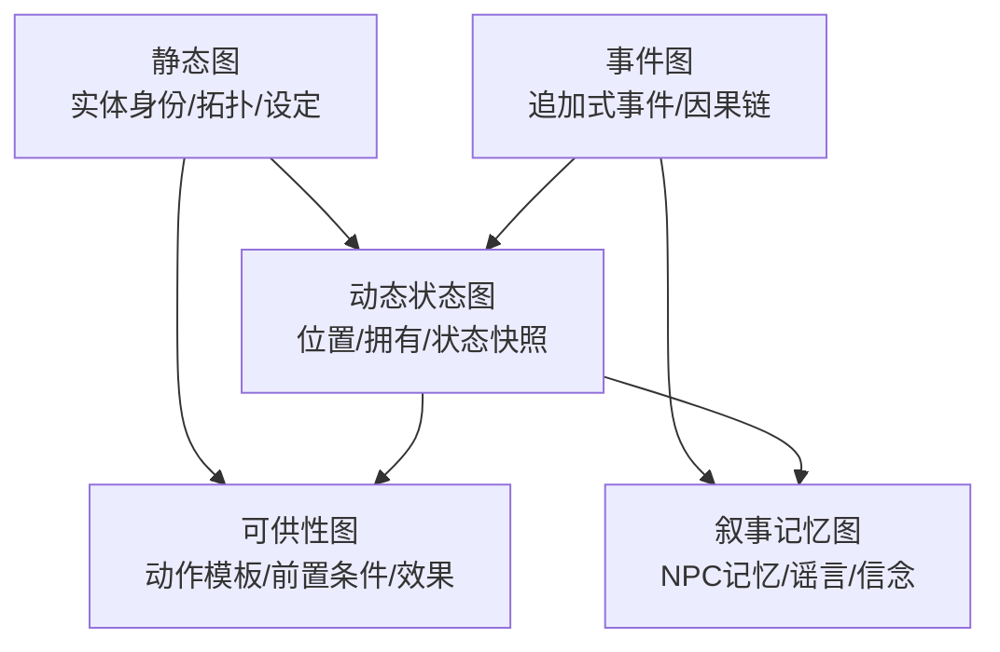
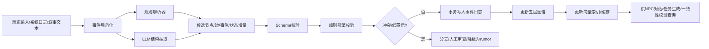
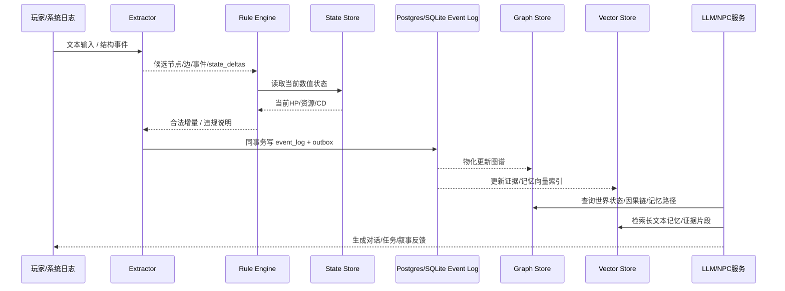
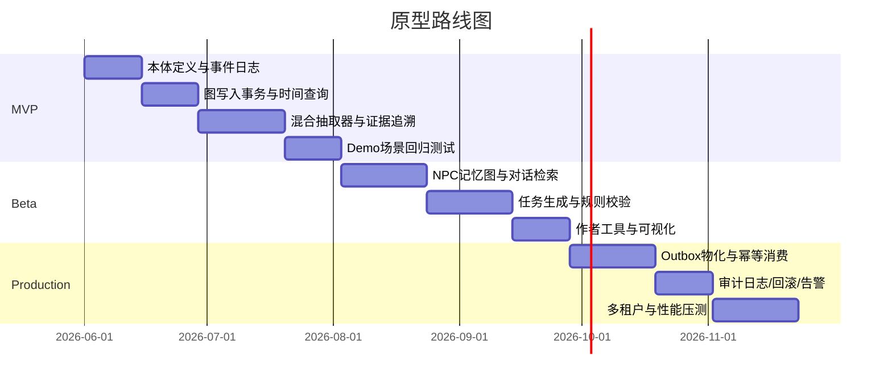

# 游戏通用知识图谱研究报告

## 执行摘要

近五年的研究已经把“游戏知识图谱”从静态世界设定库，推进到了“可执行世界结构层”。在交互叙事方向，知识图谱被证明可以提升长篇叙事的一致性与玩家对故事走向的控制感；在交互小说与文本世界方向，图谱被直接当作世界模型，用来表示局部可观测环境中的状态变化与上下文相关动作；在 NPC 对话方向，动态图谱承担长期记忆、关系演化和角色一致性维护。这说明，**真正通用的 Game World Knowledge Graph 不应只是文档三元组仓库，而应是“时间感知、事件驱动、规则可验证、记忆可分层”的属性图系统**。citeturn15view1turn15view2turn15view3turn16view4turn16view5turn16view6turn26view3turn27view0turn27view1

从工程落地看，最佳路径不是“全靠 LLM 生成世界”，而是**混合式图谱构建**：权威系统事件直接写入；低歧义结构事实用规则/解析器抽取；高歧义叙事文本由 LLM 在严格 Schema 下抽取候选，再由规则引擎与事务层校验。跨图库、向量库和数值状态库的一致性，不应寄希望于图库或向量库本身，而应以**事务型事件日志**为 source of truth，图数据库与向量数据库仅作物化视图与检索层。PostgreSQL/SQLite 的事务语义适合承担这一角色，而 Qdrant 明确不提供强事务式分布式点更新保证。citeturn24view0turn25view2turn21view7turn21view8turn32view0

因此，本文的结论是：**理论方向应选“事件溯源属性图 + 规则引擎 + 向量记忆”的三层体系；工程上先做本地单机 MVP，再演化到事件日志驱动的多存储架构**。本地 Demo 推荐 `SQLite/Kuzu/Chroma` 或 `SQLite/Neo4j/Qdrant`；生产则推荐 `Postgres + Neo4j + Qdrant`，以 Qwen3-8B/14B 负责结构抽取与生成，bge-m3 负责多语言混合检索。citeturn21view2turn30view0turn30view1turn14view8turn21view4turn32view2turn37view0turn37view1

## 文献综述与方向判断

从文献与项目实践看，近五年“游戏通用知识图谱”主要汇聚为四条线索：其一，**交互小说/文本世界的世界模型**，核心问题是“从观测恢复世界状态并约束动作空间”；其二，**KG-assisted storytelling 与任务生成**，核心问题是“如何用图谱给 LLM 提供可编辑的叙事骨架”；其三，**NPC 记忆图谱**，核心问题是“如何把设定、经验和记忆区分开”；其四，**工程化知识图谱构建工具**，核心问题是“如何以可追溯、可增量、可本地化的方式把非结构化内容转成图”。这四条线索组合起来，基本定义了通用游戏 KG 的理论边界：它既是**世界事实图**，也是**运行时状态图**，同时还是**可供性图**、**事件图**和**角色记忆图**。citeturn16view2turn16view4turn16view7turn15view4turn24view0turn29view4turn29view5

### 关键论文与项目

| 类别 | 论文/项目 | 年份 | 核心贡献 | 可借鉴结论 | 适用性评估 | 首选来源 |
|---|---|---:|---|---|---|---|
| 学术 | Guiding Generative Storytelling with Knowledge Graphs | 2025 | 研究 KG 如何提升长篇故事连贯性与用户控制，发现收益主要出现在动作导向、结构更显式的叙事里 | 图谱最适合做“可编辑叙事骨架”，而不是单纯召回背景文本 | 高 | citeturn15view1turn15view2turn15view3 |
| 学术 | Personalized Quest and Dialogue Generation in Role-Playing Games | 2023 | 用用户定义的 KG 与语言模型生成更个性化的任务与对话，项目实现基于 Neo4j Aura | 任务生成必须同时受“世界图”和“玩家意图”约束 | 高 | citeturn0search2turn18view0 |
| 学术 | Personalized Non-Player Characters | 2025 | 结合静态角色知识微调与动态图谱记忆，利用 AMR–KG 融合提升角色一致性与记忆正确性 | “设定知识”和“经验记忆”必须拆层；Memory KG 是 NPC 的关键基础设施 | 高 | citeturn15view4turn15view5turn15view6 |
| 学术 | Bringing Stories Alive: Generating Interactive Fiction Worlds | 2020 | 从故事抽取部分图谱，再补全关系与 affordance，并据此生成可玩的交互小说世界 | **Affordance** 是游戏 KG 区别于文档 KG 的关键 | 高 | citeturn16view0turn16view2turn35search3 |
| 学术 | Learning Knowledge Graph-based World Models of Textual Environments | 2021 | 同时学习预测图谱状态变化与上下文相关动作集合 | 动态图谱必须与“可执行动作”联动，而不是只记事实 | 高 | citeturn16view4turn16view5 |
| 学术 | Modeling Worlds in Text / JerichoWorld | 2021 | 提供“文本观测 → 世界图 → 相关动作”的监督数据集 | 评测要同时看状态恢复与动作相关性，不要只看三元组抽取 F1 | 高 | citeturn16view6turn16view7 |
| 学术 | Learning Dynamic Belief Graphs to Generalize on Text-Based Games | 2020 | 通过动态 belief graph 提升文本游戏泛化能力 | 游戏 KG 需要“世界真实状态”和“角色信念状态”两套表示 | 中高 | citeturn19search3turn19search6 |
| 学术 | Procedural Content Generation in Games: A Survey with Insights on Emerging LLM Integration | 2024 | 总结 PCG 方法谱系与 LLM 融合趋势 | 图谱应作为 PCG 的约束层和验证层，而非纯生成后处理 | 高 | citeturn15view7turn15view8 |
| 工程 | Neo4j LLM Knowledge Graph Builder | 2024-2025 | 给出从文档摄取、分块、嵌入、实体抽取到后处理的完整自动化管线，采用 lexical graph + entity graph 双图结构 | “证据图 + 实体图”的双图模式值得直接复用到游戏日志与叙事证据追溯 | 高 | citeturn14view8turn24view0turn24view1 |
| 工程 | Graphify | 2026 | 把代码、文档、PDF、图像、视频等映射为可查询图，并导出 `graph.json/graph.html`；代码抽取优先使用本地 tree-sitter | 创作工具链中应优先用**确定性解析**，LLM 只处理语言歧义部分 | 中 | citeturn29view0turn29view1turn29view2 |
| 工程 | CodeGraph | 2026 | 以 tree-sitter 抽 AST，本地 SQLite+FTS5 存图并增量同步 | “本地优先 + 增量更新 + 结构化索引”适合作为游戏编辑器内图谱底座 | 中 | citeturn29view4turn29view5 |
| 本体背景 | VGO / VideOWL | 2014 / 2023 | VGO 强调事件与玩家信息；VideOWL 强调 agent、artefact 与可推理游戏特征 | 通用本体至少要覆盖“事件、玩家/角色、物件、代理、关系与特征推理” | 中高 | citeturn28view0turn28view1turn28view2 |

综合这些研究，本文建议把“游戏通用知识图谱”明确定义为：**一个面向运行时世界组织的、支持时间版本化、事件回放、规则验证、可供性推理与角色记忆分层的属性图系统**。这一定义比传统企业知识图谱更强调“状态变化”和“动作可执行性”，也比普通文档图谱更强调“证据追溯”和“冲突共存”。citeturn26view0turn27view0turn16view4turn16view7turn28view0turn28view2

## 本体与动态图谱设计

VGO 与 VideOWL 说明游戏本体至少需要显式表示玩家/角色、事件、物件、代理和游戏特征；而文本世界模型与 NPC Memory 工作进一步说明，仅有静态类目不够，必须把**时间、动作、规则和记忆**也纳入一等公民。基于此，建议采用“稳定身份 + 版本记录 + 事件溯源”的本体设计。citeturn28view0turn28view2turn16view4turn15view4

### 通用游戏本体草案

| 类型 | 必需字段 | 关键关系 | 时间/版本策略 |
|---|---|---|---|
| Character | `id, stable_key, name, archetype, faction_ids, stats_ref` | `MEMBER_OF, OWNS, LOCATED_IN, KNOWS, REMEMBERS` | 身份稳定；位置/阵营/拥有权走版本化边；心理与记忆不直接覆盖世界真值 |
| Location | `id, stable_key, name, loc_type, parent_id` | `CONNECTS_TO, CONTAINS, CONTROLLED_BY` | 空间拓扑慢变；占用状态通过 State/Event 更新 |
| Item | `id, stable_key, name, item_type, rarity, stackable` | `OWNED_BY, LOCATED_IN, REQUIRED_BY, REWARD_OF` | 持有者/所在地点高频变化，用 Event + State 驱动 |
| Faction | `id, stable_key, name, doctrine, standing_rules` | `ALLIED_WITH, HOSTILE_TO, CONTROLS, ISSUES` | 阵营关系边需带有效期 |
| Rule | `id, rule_type, priority, scope, expr_ref, enabled` | `GOVERNS, FORBIDS, ENABLES, MODIFIES` | 规则版本独立管理，逻辑本体存元数据，执行体保存在规则引擎 |
| Event | `id, event_type, time_span, status, source` | `CAUSED_BY, TARGETS, CHANGES, ENABLED_BY` | **追加式不可变**；是回放、审计和回滚的主依据 |
| Quest | `id, stable_key, title, issuer_id, objective_graph, rewards, status` | `ISSUED_BY, DEPENDS_ON, TARGETS_RULE, UNLOCKS` | 任务定义慢变；任务进度走版本记录 |
| Ability | `id, stable_key, name, cost, cooldown, effect_ref` | `BELONGS_TO, USED_IN, MODIFIES_STATE` | 技能平衡改动更新版本，不改历史事件 |
| Resource | `id, owner_id, resource_type, amount, unit` | `PRODUCED_BY, CONSUMED_BY, STORED_IN` | 建议用**ledger delta**，不要直接覆盖库存历史 |
| State | `id, subject_id, turn_id, truth_scope, attrs` | `STATE_OF` | 作为快照或 delta；高频数值不直接污染静态实体 |
| Action | `id, verb, arg_schema, validator_ref, effect_template` | `CAN_TARGET, REQUIRES, PRODUCES` | 行为模板版本化，供 affordance 层绑定 |
| Affordance | `id, subject_type, action_id, preconditions, effects, score` | `ENABLES_ACTION` | 每回合可重算；可缓存为短期派生图 |
| Memory | `id, owner_id, source_event_id, salience, valence, truth_status, last_recalled_turn` | `ABOUT, REMEMBERS, MISREMEMBERS` | 与世界真值分层；支持衰减、误记和谣言共存 |

### 可直接实现的数据结构

```json
{
  "$schema": "https://json-schema.org/draft/2020-12/schema",
  "title": "GameWorldKG Core",
  "type": "object",
  "$defs": {
    "EvidenceRef": {
      "type": "object",
      "required": ["source_id", "span", "extractor", "confidence"],
      "properties": {
        "source_id": { "type": "string" },
        "span": { "type": "array", "items": { "type": "integer" }, "minItems": 2, "maxItems": 2 },
        "chunk_id": { "type": "string" },
        "extractor": { "type": "string" },
        "confidence": { "type": "number", "minimum": 0, "maximum": 1 }
      }
    },
    "EntityVersion": {
      "type": "object",
      "required": [
        "id", "stable_key", "world_id", "entity_type", "version",
        "valid_from_turn", "properties", "scope", "confidence"
      ],
      "properties": {
        "id": { "type": "string" },
        "stable_key": { "type": "string" },
        "world_id": { "type": "string" },
        "entity_type": { "type": "string" },
        "version": { "type": "integer", "minimum": 1 },
        "valid_from_turn": { "type": "integer", "minimum": 0 },
        "valid_to_turn": { "type": ["integer", "null"] },
        "recorded_at": { "type": "string", "format": "date-time" },
        "scope": { "enum": ["canonical", "player", "npc", "faction", "rumor"] },
        "properties": { "type": "object" },
        "source_event_id": { "type": ["string", "null"] },
        "evidence_refs": { "type": "array", "items": { "$ref": "#/$defs/EvidenceRef" } },
        "confidence": { "type": "number", "minimum": 0, "maximum": 1 }
      }
    },
    "RelationVersion": {
      "type": "object",
      "required": [
        "id", "src", "rel_type", "dst", "version",
        "valid_from_turn", "scope", "confidence"
      ],
      "properties": {
        "id": { "type": "string" },
        "src": { "type": "string" },
        "rel_type": { "type": "string" },
        "dst": { "type": "string" },
        "version": { "type": "integer", "minimum": 1 },
        "valid_from_turn": { "type": "integer", "minimum": 0 },
        "valid_to_turn": { "type": ["integer", "null"] },
        "scope": { "enum": ["canonical", "player", "npc", "faction", "rumor"] },
        "properties": { "type": "object" },
        "source_event_id": { "type": ["string", "null"] },
        "evidence_refs": { "type": "array", "items": { "$ref": "#/$defs/EvidenceRef" } },
        "confidence": { "type": "number", "minimum": 0, "maximum": 1 }
      }
    },
    "EventRecord": {
      "type": "object",
      "required": ["event_id", "event_type", "turn_id", "participants", "state_deltas"],
      "properties": {
        "event_id": { "type": "string" },
        "event_type": { "type": "string" },
        "turn_id": { "type": "integer" },
        "participants": { "type": "array", "items": { "type": "string" } },
        "causal_parents": { "type": "array", "items": { "type": "string" } },
        "state_deltas": { "type": "array", "items": { "type": "object" } },
        "evidence_refs": { "type": "array", "items": { "$ref": "#/$defs/EvidenceRef" } }
      }
    }
  }
}
```

版本化策略建议采用“**稳定身份 + 有效时间 + 记录时间**”：实体与关系的 `stable_key` 永不变，`version` 单调递增；`valid_from_turn/valid_to_turn` 表示游戏内有效时间，`recorded_at` 表示系统记录时间；**世界真值**、**NPC 记忆**、**谣言/误记**通过 `scope` 分层表示，不互相覆盖。高频数值属性优先写入 `State/Resource ledger`，避免把图数据库变成数值热写表。这个设计直接呼应了图记忆研究对 extraction / storage / retrieval / evolution 生命周期的划分。citeturn26view0turn26view1turn26view2

### 五层动态图谱与原子操作集



| 操作 | 语义 | 事务要求 |
|---|---|---|
| `ADD_NODE` | 创建稳定身份节点 | 幂等，按 `stable_key` 去重 |
| `ADD_EDGE` | 创建关系身份 | 幂等，按 `(src, rel, dst, scope)` 去重 |
| `UPSERT_NODE_VERSION` | 新增实体版本 | 需带 `expected_version` |
| `UPSERT_EDGE_VERSION` | 新增关系版本 | 需关闭旧有效版本 |
| `CLOSE_VERSION` | 结束旧版本有效期 | 与新版本同事务 |
| `SET_STATE` | 写状态快照/增量 | 与事件记录同事务 |
| `MOVE_ENTITY` | 位置迁移快捷操作 | 展开为 `Event + StateDelta` |
| `DELTA_RESOURCE` | 资源账本增减 | 不覆盖历史，只追加 delta |
| `START_EVENT` | 建立事件记录 | 追加式，不回写覆盖 |
| `END_EVENT` | 标记事件完成/失败 | 事件状态版本化 |
| `ADD_MEMORY` | 为角色加入记忆条目 | 与 salience/valence 同写 |
| `RECALL_MEMORY` | 更新 recall 计数与时间 | 可异步低优先级 |
| `ASSERT_RULE` | 注册/启用规则元数据 | 与规则引擎版本同步 |
| `LINK_EVIDENCE` | 绑定证据片段 | 所有抽取结果都应可回溯 |

冲突解决建议遵循三条原则。第一，**身份冲突**先做实体消歧，不确定则新建临时实体而不是强行合并。第二，**事实冲突**不直接覆盖，优先形成平行版本或平行 scope；例如“世界真值”为 canonical，“酒馆传闻”为 rumor。第三，**并发冲突**按事件顺序与权威级别裁决：系统事件 > 设计器编排 > 规则推导 > 玩家/NPC 自然语言陈述。Drools 之类规则引擎支持 agenda 与 conflict resolution，但跨存储真正的一致性仍应由事务日志和 outbox 保证。citeturn23search0turn23search2turn23search11turn21view7turn21view8

## 抽取更新、存储检索与规则集成

### 抽取方法比较与推荐

规则式抽取适用于 UI 日志、战斗记录、配置表、脚本事件等高结构输入，优点是高精度、低延迟、可解释，缺点是覆盖面窄；LLM 抽取适用于剧情文本、NPC 对话、任务描述、百科设定等高歧义输入，优点是覆盖广、能处理隐含关系，缺点是幻觉与不稳定。Neo4j Builder 的经验明确指出，传统 rule/pattern 方法对自然语言变化脆弱，而 LLM 更能处理隐式关系与复杂句式；但同时又需要 schema、chunking、后处理和证据链来降低噪声。LlamaIndex 的 PropertyGraphIndex 进一步说明，结构抽取最有效的方式是**严格 schema + 可定制抽取 prompt + 多种检索器组合**。因此，推荐采用**混合方法**：系统事件直写，规则解析保底，LLM 只在高歧义层补全候选图。citeturn24view0turn25view2

#### 推荐的抽取流程



#### 提示模板

```text
你是“游戏世界图谱抽取器”。请从输入文本中抽取：
1) nodes：实体节点（Character, Location, Item, Faction, Quest, Event）
2) edges：关系
3) events：事件记录
4) state_deltas：可执行状态变化
5) memories：若文本是NPC主观叙述，则写入memory层而非canonical层
要求：
- 只能输出JSON
- 尽量使用给定schema；不确定时输出 uncertain=true 并降低 confidence
- 每一条结果必须带 evidence span
- 若出现与现有canonical冲突的事实，不覆盖，改写到 rumor/npc scope

输入文本：
{{text}}

已有schema：
{{schema}}

已有上下文实体：
{{entity_candidates}}
```

#### 抽取输出格式示例

```json
{
  "nodes": [
    {
      "tmp_id": "c1",
      "entity_type": "Character",
      "stable_key": "guard_alos",
      "properties": {"name": "阿洛斯"},
      "scope": "canonical",
      "confidence": 0.94,
      "evidence": {"source_id": "turn_128", "span": [0, 2]}
    },
    {
      "tmp_id": "i1",
      "entity_type": "Item",
      "stable_key": "silver_key",
      "properties": {"name": "银钥匙"},
      "scope": "canonical",
      "confidence": 0.91,
      "evidence": {"source_id": "turn_128", "span": [9, 12]}
    }
  ],
  "events": [
    {
      "event_type": "CONFISCATE",
      "participants": ["c1", "i1"],
      "turn_id": 128,
      "confidence": 0.89
    }
  ],
  "state_deltas": [
    {"entity": "i1", "attr": "holder", "new": "c1", "confidence": 0.88}
  ]
}
```

置信度建议不要只靠模型自报，而应由四项合成：`schema_pass`、`rule_pass`、`self_consistency`、`source_authority`。实现上可用 0~1 浮点 + `evidence_refs[]` + `authority` 三元表示；低于阈值的结果不进 canonical，只进候选区或 memory/rumor scope。citeturn24view0turn25view2

### 存储与检索技术栈评估

#### 图数据库与图存储

| 方案 | 主要优势 | 主要限制 | 适合位置 | 关键依据 |
|---|---|---|---|---|
| Neo4j | 成熟 Cypher、完整 ACID、工具链强，且有官方 LLM KG Builder | 本地轻量性不如嵌入式图库 | Beta/生产图谱服务层 | citeturn22search0turn22search7turn14view8 |
| Memgraph | 强一致 ACID、Cypher、实时分析友好 | 内存型架构对大世界常驻成本更高 | 实时事件分析/中型在线服务 | citeturn30view4 |
| Kuzu | 嵌入式、Serializable ACID、属性图、JSON/FTS/Vector 扩展、本地集成成本低 | 官方定位偏分析型单机/嵌入式，不是首选高并发在线写服务 | 本地 Demo / 单机工具 / 编辑器插件 | citeturn21view2turn30view2turn30view3 |
| JanusGraph | 面向超大规模分布式图，可跑在 Cassandra/HBase 等后端 | 官方文档明确说明在多数后端上不一定 ACID，事务语义依赖底层存储 | 只有在图规模超单机且团队熟悉分布式时考虑 | citeturn21view0turn21view1 |

#### 向量库与事务型存储

| 方案 | 主要优势 | 主要限制 | 适合位置 | 关键依据 |
|---|---|---|---|---|
| Qdrant | Hybrid retrieval、payload index、过滤能力强，支持分布式扩展 | 官方明确说明点操作**不提供强事务式分布式更新保证** | 生产级记忆/证据检索层 | citeturn21view4turn32view0turn32view1turn32view2 |
| Milvus | 分布式扩展强，WAL 与多级一致性，适合很大规模向量检索 | 运维复杂度更高，适合专门向量服务团队 | 超大规模检索层 | citeturn21view5turn33search0turn33search1turn33search17 |
| Chroma | Local / persistent client 简单，单节点适合中小规模，开发体验友好 | 单节点定位明确，更适合原型与中小规模 | 本地 Demo / 研究原型 | citeturn30view0turn30view1 |
| PostgreSQL | 完整事务隔离、多种隔离级别、JSON 友好 | 图遍历不如图数据库自然 | **事件日志与数值世界状态的 source of truth** | citeturn21view7 |
| SQLite | 原子提交、嵌入式、极简部署 | 网络并发与跨机扩展有限 | 本地 Demo 审计日志 / 单机 outbox | citeturn21view8turn6search15 |

#### 推荐组合与部署建议

| 场景 | 推荐组合 | 理由 |
|---|---|---|
| 小型本地 Demo | `SQLite + Kuzu + Chroma` | 全本地、低运维、可快速验证本体/更新/查询闭环 |
| 单机 Beta | `Postgres + Neo4j + Qdrant` | 把事务、图服务、向量检索清晰分层，便于后续扩展 |
| 云/生产 | `Postgres(事件日志) + Neo4j(服务图) + Qdrant/Milvus(检索)` | 一致性、可观测性和横向扩展更清晰 |
| 混合作者工具链 | `SQLite/Kuzu` 本地创作，`Neo4j/Qdrant` 云端发布 | 创作本地优先，发布与运行远端化 |

#### 硬件需求估算

下表为**工程经验估算**，不是官方要求。模型方面，Qwen3 提供 8B/14B 等开源权重，bge-m3 支持多语言、dense+sparse+multi-vector 混合检索，适合本项目。citeturn37view0turn37view1

| 档位 | 典型负载 | 建议硬件 |
|---|---|---|
| 小型 Demo | 1 个世界、1 万~10 万节点、单人测试 | 8 核 CPU / 32GB RAM / 1TB NVMe；可选 12~16GB VRAM 做 4-bit 8B 抽取推理 |
| Beta | 多 NPC、持续日志写入、自动任务生成 | 16 核 CPU / 64GB RAM / 2TB NVMe；24GB 级 GPU 更适合 14B 本地推理 |
| 生产 | 多租户世界、长期审计、在线检索 | 32 核以上 / 128GB+ RAM / 图库与向量库分机；模型服务单独部署 |

### 规则引擎与世界状态的集成

规则引擎的职责不是替代图谱，而是让图谱可执行。Drools 的基本机制是把 facts 放入 working memory，再由规则条件匹配决定执行；同时它支持 agenda groups、activation groups 等冲突控制。落到游戏里，建议这样分工：**图谱存“符号世界”，数值状态库存“HP/金币/冷却/CD”等高频值，规则引擎负责前置条件、效果应用与合法性裁决，LLM 只负责抽取候选和表面化生成**。citeturn23search0turn23search2turn23search11turn23search18



一致性上，建议采用两种模式。**本地 MVP** 用单机事务：事件日志与图写入同进程完成。**生产模式** 用 `event_log + outbox`：只要 `event_log` 成功提交，世界真值就成立；图数据库与向量数据库异步物化、幂等消费。这样可规避图库与向量库各自的事务边界问题，也能天然支持回滚、重放和 time-travel query。citeturn21view7turn21view8turn32view0

## 应用验证与实施路线

### 应用场景与验证实验

| 场景 | 输入 | 对照组 | 指标 | 数据采集与评估 |
|---|---|---|---|---|
| 长篇叙事一致性维护 | 多回合剧情文本 + 世界状态 | 仅上下文窗口的 LLM | 自相矛盾率、实体失配率、人评连贯性 | 采集 100 段多回合剧情，人工标注矛盾点 + 双盲评分 |
| 任务/任务链自动生成 | 当前世界图 + 玩家画像 + 规则 | 纯 LLM 生成 | 任务相关性、依赖合法性、奖励平衡、可完成率 | 自动 validator + 玩家问卷 + 完成日志 |
| NPC 记忆与个性化对话 | 历史互动日志 + NPC 设定 | 仅摘要记忆 / 仅向量记忆 | 记忆正确率、角色一致性、幻觉率、延迟 | 人工标注问答集 + 在线 A/B |
| 受约束程序化内容生成 | 地图/派系/资源约束 | 无图约束 PCG | 约束满足率、可玩性、资源一致性、内容新颖度 | 规则校验器 + 设计师评分 |
| 玩家行为影响长期世界 | 事件流（交易、战斗、政治） | 只保留当前状态无事件链 | 因果可解释性、回放正确率、长期平衡度 | 事件重放测试 + 回滚一致性测试 |

评估上不建议只看抽取 F1，而要同时考察四类指标：**世界一致性**、**动作/任务可执行性**、**玩家主观感知**、**系统延迟**。JerichoWorld 与 World Models 路线已经证明，如果只评测文本到三元组，不评测“相关动作”和“状态变化”，很容易得到漂亮但不可玩的图谱。citeturn16view4turn16view7

### 原型实现路线图

推荐分三阶段推进。MVP 阶段只做“事件日志—图谱更新—查询闭环”；Beta 阶段加入 NPC 记忆、任务生成和规则引擎；生产阶段再做 outbox、审计、回滚和多租户。模型选择上，本地优先 `Qwen3-8B/14B + bge-m3`；框架优先 `FastAPI + Pydantic` 做服务编排，`LlamaIndex PropertyGraphIndex` 仅作为可选加速层，用于 schema-strict 抽取器和多检索器组合。citeturn37view0turn37view1turn25view2



| 阶段 | 最小可行组件 | 建议模型/框架 | 测试用例 | 验收标准 |
|---|---|---|---|---|
| MVP | 事件日志、图写入、时态查询、证据链 | Qwen3-8B、bge-m3、SQLite/Kuzu/Chroma | 实体冲突、关系覆盖、time-travel query | 能回放 1000 条事件且查询一致 |
| Beta | NPC 记忆层、任务生成器、规则引擎 | Qwen3-14B、Postgres/Neo4j/Qdrant、Drools | 记忆问答、任务合法性、规则冲突 | 任务依赖合法率 > 85%，NPC 记忆正确率显著优于基线 |
| 生产 | Outbox、幂等消费、审计回滚、多租户 | 远程 Neo4j/Qdrant + 模型服务 | 故障恢复、重复消费、并发写入 | 关键查询 p95 可控，重复消费无脏写，支持按事件回滚 |

## 风险、伦理与参考实现

### 风险、限制与伦理

| 风险 | 典型表现 | 缓解策略 |
|---|---|---|
| 知识图谱错误传播 | 错误实体/关系进入 canonical，后续任务与对话全错 | 置信阈值、scope 分层、人工审查队列、版本回滚 |
| LLM 幻觉 | 虚构人物、地点、因果关系 | 严格 schema、abstain 机制、规则校验、证据强绑定 |
| 长期一致性漂移 | 图谱与数值状态不一致，或图/向量视图异步失真 | 事件日志为真值、outbox 幂等、周期 reconciliation |
| 玩家隐私 | 把玩家行为日志长期写入记忆图 | 本地模式、PII 脱敏、TTL、最小化保留、显式同意 |
| 可解释性不足 | 难以说明 NPC 为什么这样回复/任务为何生成 | `evidence_refs`、event replay、query trace、审计日志 |
| 维护成本 | schema 漂移、补丁更新困难 | 本体治理、迁移脚本、回归集、规则版本管理 |

需要特别指出的是，Graph-based Agent Memory 研究本身已把 memory 错误、演化和可靠性列为核心挑战；而 Neo4j Builder 的工程经验也指出知识抽取必须包含后处理与 schema consolidation，否则“自动建图”很容易变成“自动制造噪声”。因此，**可控性与可解释性不是补充功能，而是通用游戏 KG 的内建要求**。citeturn26view3turn24view0

### 参考实现片段

#### 事务写入伪代码

```python
def apply_world_update(tx, extracted):
    # 1. 记录事件
    event_id = tx.insert_event(extracted["event"])

    # 2. 版本化写实体
    for node in extracted["nodes"]:
        tx.upsert_entity_version(
            stable_key=node["stable_key"],
            entity_type=node["entity_type"],
            properties=node["properties"],
            source_event_id=event_id,
            scope=node.get("scope", "canonical"),
            confidence=node["confidence"],
            evidence=node["evidence"],
        )

    # 3. 写关系与状态增量
    for edge in extracted.get("edges", []):
        tx.upsert_relation_version(...)
    for delta in extracted.get("state_deltas", []):
        tx.apply_state_delta(subject=delta["entity"], attr=delta["attr"], value=delta["new"])

    # 4. Outbox 供图库/向量库物化
    tx.append_outbox(topic="world_graph_update", payload={"event_id": event_id})
```

#### 查询示例

```cypher
MATCH (npc:Character {stable_key: $npc})-[:REMEMBERS]->(m:Memory)-[:ABOUT]->(e)
WHERE m.salience > 0.6
RETURN e.stable_key AS fact, m.truth_status AS truth, m.last_recalled_turn AS last_used
ORDER BY m.salience DESC, m.last_recalled_turn DESC
LIMIT 10;
```

#### 抽取结果最小 JSON 契约

```json
{
  "source_id": "turn_481",
  "nodes": [],
  "edges": [],
  "events": [],
  "state_deltas": [],
  "memories": [],
  "evidence": []
}
```

### 开放问题与限制

当前仍有几个问题值得在正式立项前单独验证。其一，**大世界中的 memory graph 衰减与压缩策略**：存全量最稳，但成本高；只存摘要最便宜，但解释性差。其二，**实体消歧与别名合并**：这是所有自动建图系统的硬骨头。其三，**跨存储实时一致性**：即使采用 outbox，也要在读路径明确“读旧图还是读最新事件”。其四，**affordance 的存储方式**：是预计算缓存，还是查询时按规则动态推导，需要按游戏类型决定。citeturn26view0turn24view0

## 结论

“游戏通用知识图谱”的正确方向，不是静态百科，也不是让 LLM 直接“脑补”一个世界，而是构建一个**可执行的世界结构层**：用事件日志承载真值，用属性图组织世界与记忆，用规则引擎裁决合法变化，用向量检索补充长文本证据。文献、开源项目与数据库实践已经给出相当一致的证据：**世界图、动作图、记忆图和证据图要分层；真值、信念与谣言要分 scope；事务日志要先于图库与向量库**。按这一方向推进，才能让世界模拟具备长期一致性、可回滚性、NPC 个体化与任务/叙事可控性。citeturn27view0turn26view0turn16view4turn24view0turn21view7turn32view0

## 可直接开始的小型实验建议

| PoC | 目标 | 输入 | 预期输出 | 评估指标 | 所需资源 |
|---|---|---|---|---|---|
| 文本日志建图 | 验证混合抽取是否可用 | 100 条战斗/交易/剧情日志 | 事件、状态增量、证据链 | schema 通过率、canonical 错误率、写入延迟 | SQLite + Kuzu/Neo4j + Qwen3-8B |
| NPC 记忆问答 | 验证 Memory Graph 的收益 | 1 个 NPC，20 轮互动历史 | 带记忆引用的回答 | 记忆正确率、角色一致性、人评偏好 | Neo4j/Qdrant + Qwen3-14B |
| 任务链生成 | 验证世界图约束任务生成 | 玩家画像 + 世界状态 + 任务模板 | 3 条任务候选及依赖图 | 合法性、相关性、可完成性 | Postgres/Neo4j + 规则模块 |
| 事件回放与回滚 | 验证事件溯源设计 | 1000 条世界事件 | 任意 turn 的世界快照 | 回放正确率、回滚一致性 | SQLite/Postgres + 图物化器 |
| Affordance 校验器 | 验证“可行动性”层 | 角色、地点、物品、规则 | 当前可执行动作集合 | 动作相关率、非法动作拦截率、p95 响应 | 规则引擎 + 图查询层 |

